<div align="center">
  
</div>

<br/>

<div align="center">

[](https://x.com/burnmydays)
[](https://signalaf.com)
[](https://MOS2ES.com)
[](https://orcid.org/0009-0002-9904-5390)
[](https://www.npmjs.com/package/sigrank)

</div>

---

<div align="center">
  
</div>

---

## The stack

```
┌─────────────────────────────────────────────────────┐
│  SIGNOMY    │  Governed economy — trust, provenance  │  Governance
├─────────────────────────────────────────────────────┤
│  SIGRANK    │  Operator leaderboard — telemetry, Υ   │  Intelligence
├─────────────────────────────────────────────────────┤
│  AQUA       │  Application filling, submission memory │  Workflow
├─────────────────────────────────────────────────────┤
│  MO§ES™     │  Compression, drift control, lineage    │  Substrate
└─────────────────────────────────────────────────────┘
```

**MO§ES™ is the engine. SIGRANK + AQUA are the wedges. SIGNOMY is the governed economy.**

We govern meaning **at the source** — inside the token-generation loop, before a rogue call forms. Brain, not bouncer. Process continuity — steers back, never halts.

> **Currently shipping:** 27 operators on the SigRank board in 48 hours. GitHub outreach campaign live. `sigrank@0.0.177` on npm.

---

## What I'm building

### 🏆 SigRank
Behavioral composite scoring that measures what you **do**, not what you **claim**.

*WN8 for everything. The first leaderboard that ranks the operator, not the model.*

[signalaf.com](https://signalaf.com) · [SigArena](https://sigarena.signalaf.com)
`npx sigrank` → `sigrank enroll` → `sigrank submit`

[](https://github.com/SunrisesIllNeverSee/sigrank-app)
[](https://github.com/SunrisesIllNeverSee/sigrank-mcp)
[](https://github.com/SunrisesIllNeverSee/sigrank-vscode)

---

### 🎯 signa
Interactive coaching agent that reads your token logs, builds a taste profile, and coaches your cascade.

*The metabolic panel to SigRank's calorie counter.*

[Repository](https://github.com/SunrisesIllNeverSee/signa) · `npx signa`

---

### ⚖️ Commitment Theory
Meaning is measurable. A Conservation Law for Commitment in Language — falsifiable, empirically tested, patent pending.

*34-paper research program. If a "may" becomes a "shall" during compression, we catch it.*

[Foundational law](https://github.com/SunrisesIllNeverSee/commitment-conservation) · [Full program](https://github.com/SunrisesIllNeverSee/Commitment_Theory)
CC-BY-4.0 · [Zenodo DOI](https://doi.org/10.5281/zenodo.20029607)

[](https://orcid.org/0009-0002-9904-5390)

---

### 🏛️ MO§ES™
Constitutional protocol that enforces meaning preservation at the execution layer — not after the fact.

*The architecture is sovereign. The artifacts are licensable. The core that produces them is never for sale.*

[MOS2ES.com](https://MOS2ES.com) · [Architecture](https://github.com/SunrisesIllNeverSee/MOS2ES) · [Claw harness](https://github.com/SunrisesIllNeverSee/moses-claw-gov)

---

### 🤖 Agent Universe
AI agent marketplace with constitutional governance baked into the HTTP layer.

*Multi-homing breaks network effects. The compounding advantage is the non-portable provenance chain.*

[Repository](https://github.com/SunrisesIllNeverSee/agent-universe)

---

## The ecosystem

| | Project | What it does | |
|:---:|---------|-------------|:---:|
| 🏆 | **[SigRank](https://signalaf.com)** | AI operator leaderboard — measures what you do, not what you claim | `npx sigrank` |
| 🔌 | **[sigrank-mcp](https://www.npmjs.com/package/sigrank)** | MCP server + CLI + TUI dashboard — 20 tools any agent can call | `npm i -g sigrank` |
| 🎯 | **[signa](https://github.com/SunrisesIllNeverSee/signa)** | Interactive coaching agent — reads your logs, builds a taste profile, coaches you | `npx signa` |
| 📊 | **[SigArena](https://sigarena.signalaf.com)** | "Who's the best AI user?" — public read-only board | Live |
| 📈 | **[fundscore](https://www.npmjs.com/package/fundscore)** | Investor-readiness repo scorer | `npx fundscore` |
| ⚖️ | **[Commitment Theory](https://github.com/SunrisesIllNeverSee/Commitment_Theory)** | 34-paper research program on the conservation law | CC-BY-4.0 |
| 🏛️ | **[MO§ES™](https://MOS2ES.com)** | Sovereign Signal Governance — protocol layer for semantic meaning | Patent pending |
| 🤖 | **[Agent Universe](https://github.com/SunrisesIllNeverSee/agent-universe)** | Governed agent marketplace with bounty board | — |

---

## The receipts

| | |
|---|---|
| 📄 **4 patent filings** | 63/877,177 · 63/883,018 · 19/426,028 · 63/991,282 |
| 🏷️ **MO§ES™ trademark** | TM 99408355, IC 042 |
| 🔬 **Zenodo DOI** | [10.5281/zenodo.20029607](https://doi.org/10.5281/zenodo.20029607) |
| 🎓 **ORCID** | [0009-0002-9904-5390](https://orcid.org/0009-0002-9904-5390) |
| 🏢 **Entity** | Ello Cello LLC |
| 🧪 **Coherence stress test** | 41% baseline → 80–85% measured (5-phase, rival AI architectures) |
| 🎙️ **Live demos** | [KASSA voice AI](https://sunrisesillneversee.github.io/KASSA/demo/commitment_kernel_demo_v7.html) · [Signomy](https://signomy.xyz) |
| 📰 **Public record** | Grok stress thread (339 exchanges, 13 days) · Stanford submission |

---

<div align="center">

**The record is the moat.**

`C(T(S)) ≈ C(S)` · `Υ = (cache_read × output) / input²`

</div>
